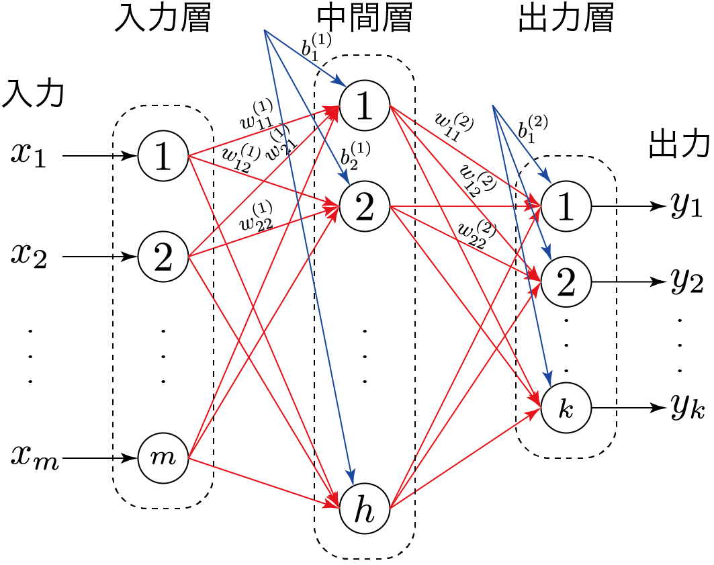

# ニューラルネットワークによる手書き数字認識
- Keras の mnist データを使ってみる
- https://github.com/rinsaka/keras-number-tegaki

### 01-read.py
- Kerasでサンプルデータを読み取るだけ

### 02-reshape.py
- 1次元配列に変換して，さらに正規化する

### 03-reshape.py
- 02の表示を工夫するだけ -> 「0.00」 なら 「    」に書き換える

### 04-y.py
- 03 の表示に，正解ラベルも加える

### 05-y-one-hot.py
- 4の正解ラベルを one-hot-encoding にする

### 06-model.py
- モデルを記述してみる

- これを実行すると次のような結果が表示される

~~~
Layer (type)                 Output Shape              Param #   
=================================================================
dense_1 (Dense)              (None, 64)                50240     
_________________________________________________________________
dense_2 (Dense)              (None, 10)                650       
=================================================================
Total params: 50,890
Trainable params: 50,890
Non-trainable params: 0
_________________________________________________________________
~~~

- 上の意味は
- 入力層→中間層の重みパラメータ(w)の数が m × h =  784 x 64 = 50,176  ... (1)
- 中間層のバイアス b が h = 64  ... (2)
- その合計((1)+(2))が 50,176 + 64 = 50,240 ... (3) ←←← 出力 dense_1 Param # のこと
- 中間層→出力層の重みパラメータ(w)の数が h × k = 64 x 10 = 640 ... (4)
- 出力層のバイアス b が k = 10 ... (5)
- その合計 ((4)+(5)) が 640 + 10 = 650 (6) ←←← 出力 dense_2 の Param # のこと
- 総パラメータ数 ((3)+(6)) 50,240 + 650 = 50,890 ←←←出力 Total params のこと

### 07-train.py
- 学習コードを1行追加しただけ
- これだけで，学習経過が表示される

~~~
60000/60000 [==============================] - 1s 23us/step - loss: 0.3665 - acc: 0.9008
Epoch 2/12
60000/60000 [==============================] - 1s 20us/step - loss: 0.1868 - acc: 0.9462
Epoch 3/12
60000/60000 [==============================] - 1s 20us/step - loss: 0.1409 - acc: 0.9592
Epoch 4/12
60000/60000 [==============================] - 1s 20us/step - loss: 0.1137 - acc: 0.9671
Epoch 5/12
60000/60000 [==============================] - 1s 20us/step - loss: 0.0966 - acc: 0.9718
Epoch 6/12
60000/60000 [==============================] - 1s 20us/step - loss: 0.0833 - acc: 0.9756
Epoch 7/12
60000/60000 [==============================] - 1s 20us/step - loss: 0.0734 - acc: 0.9789
Epoch 8/12
60000/60000 [==============================] - 1s 20us/step - loss: 0.0657 - acc: 0.9811
Epoch 9/12
60000/60000 [==============================] - 1s 20us/step - loss: 0.0587 - acc: 0.9826
Epoch 10/12
60000/60000 [==============================] - 1s 21us/step - loss: 0.0541 - acc: 0.9846
Epoch 11/12
60000/60000 [==============================] - 1s 24us/step - loss: 0.0496 - acc: 0.9857
Epoch 12/12
60000/60000 [==============================] - 1s 21us/step - loss: 0.0450 - acc: 0.9873
~~~

- 6万枚のデータを12エポック（回）繰り返し学習させている
- エポック（ステップ）が進むにつれて，損失関数の値 (loss)が小さくなり，判別精度 (acc) が 1.0 に近づいていることがわかる
- なお，verbose は学習過程（途中経過）を画面に出力するためのオプション（0, 1, 2 のいずれかを指定）
  0 : ログの出力なし
  1 : プログレスバーで表示
  2 : エポックごとに１行のログを出力

### 08-evaluate.py
- モデルを評価する
- model.evaluate によって評価する
- 損失関数値と予測精度が得られる

### 09-predict.py
- 予測する

### 10-save-model.py
- 学習結果をファイルに保存する
- number_model.json：モデルの情報
- number_predict.hdf5：推定された重みパラメータの情報

### 11-load-model.py
- 10-save-model.py で保存したモデルの情報と重みパラメータを読み込む（だけ）

### 12-load-eval.py
- 10-save-model.py で保存したモデルの情報と重みパラメータを読み込み，評価（テスト）する

### 13-load-predict.py
- 10-save-model.py で保存したモデルの情報と重みパラメータを読み込み，予測する
- 内容は 09-predict.py と同様で，学習せずに学習済みの結果を読み込んでいる
